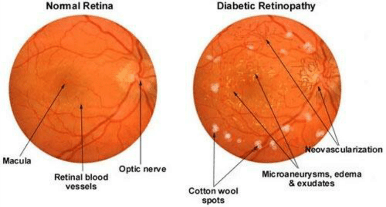
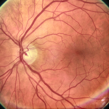
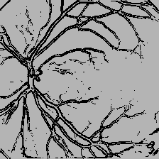
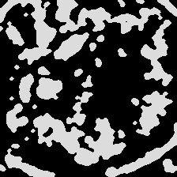

# Diabetic Retinopathy Detection

It is complication of diabetes that affects the eyes. Diabetic retinopathy is caused by damage to the blood vessels in the tissue at the back of the eye(retina). This disease can lead to blindness if not taken care of in early stages.

## Requirements

opencv

scikit

## To Run

python extract.py -v retina.png -e retina.png

## Fundus Image

## Blood vessels Extraction

Green channel image is separated as the blood vessel appears brighter in the green channel image. Then we apply Kirsch filter to remove the noise in the input image. The Kirsch Edge module detects edges using eight compass filters. All eight filters are applied to the image with the maximum being retained for the final image. The eight filters are a rotation of a basic compass convolution filter. Histogram equalization is applied to the filtered image.

## Exudates Extraction

Green channel is used to detect the exudates. Morphological operations are applied. CLAHE is an adaptive extension of Histogram Equalization which helps in dynamic preservation of the local contrast characteristics of an image. We apply morphological operation to dilate the image. The closing operation is defined as dilation followed by erosion(median filter). Erosion shrinks objects in a binary image.